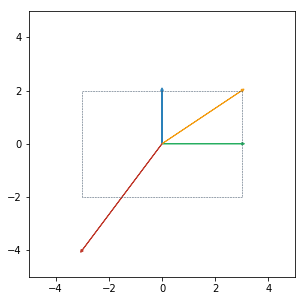
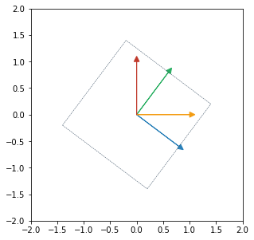
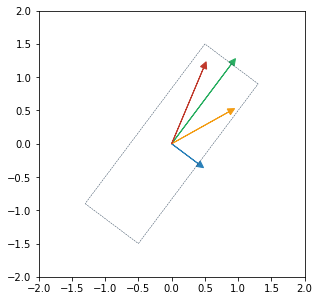

# 2 Linear Algebra

`page 30` Just a note-to-self: indices for a 2D matrix refers to row then column eg.  refers to element in row 1 and column 2 of matrix A.

`page 32` Broadcasting is more than just a notation convenience. When using libraries such as numpy and Tensorflow, broadcasting can reduce the memory requirements of a program, compared to alternatives such as `tf.tile`.

`page 33` When using neural networks for regression, a way of looking at the problem is to see the final layer of the network as a system of linear equations, assuming no activation.

where  is the predicted output,  is the feature vector output from the second last layer and  and  are the weights and bias of the final layer. Assuming we fix the earlier layers, we can then solve directly for the weights and bias given enough samples, although such a solution is not guaranteed to generalize to unseen samples.

`page 37` **Norms.** Intuitively, norm is used as a proxy for the size of the vector. We can then put into context the three properties of norms.

- 

The norm/size of a vector is zero if and only if the vector is the zero vector.

- 

The norm/size of the sum of two vectors should be no greater than the sum of the sizes of the two vectors. More specifically, the equality holds when the two vectors are parallel. Also known as the triangle inequality, where the length of any side of a triangle cannot be greater than the sum of the lengths of the other two sides.

- 

Scaling a vector scales its norm/size by the same positive amount since size must be more than or equal to zero. The size of a doubled vector is twice the size of the original vector. 

`page 38` An important concept that comes up often is the cosine similarity. I take a special interest in metalearning, where several algorithms make use of cosine similarity for few-shot learning, see: ([Vinyals et al., 2016](https://arxiv.org/abs/1606.04080)) ([Gidaris & Komodakis, 2018](https://arxiv.org/abs/1804.09458)) ([Qi et al., 2017](https://arxiv.org/abs/1712.07136)) ([Luo et al., 2017](https://arxiv.org/abs/1702.05870))

`page 41` **Eigendecomposition.** In my personal experience, this topic is often poorly taught in a non-intuitive manner, where at best, students go away remember the equation  without any real understanding of what eigenvectors mean.

Consider the following matrix:

It might be apparent that its two eigenvectors are 

with respective eigenvalues of 3 and 2, since

We then adopt the view that a matrix multiplication can be seen as a space transformation.

Suppose we have four vectors

which can be conveyed on a 2D graph.

If we do a matrix multiplication between  and each of the four vectors, we will get 

Comparing the two graphs, we see that the second graph is simply the first but scaled by a factor of 3 along the x-axis and 2 along the y-axis, sort of like transforming a digital image by grabbing and shifting the border (see the dashed boxes in the graphs).

Furthermore, we can see that blue and green vectors (the eigenvectors of the matrix) do not change in direction, only in magnitude. These vectors are like the main axes of the scaling process. With a bit of imagination, we can also see that any vectors parallel to the blue or green vectors will also only change in magnitude and not direction, after the matrix multiplication.

In contrast, both the red and yellow vectors change in direction and magnitude, shifting slightly clockwise. Likewise for any vectors not parallel to the blue and green.

Consider another matrix

After some thought, we can see that a possible set of eigenvectors are 

with respective eigenvalues of 1.5 and 0.5.

Suppose again we have four vectors

After matrix multiplication with , we will get

Again we can see that blue and green vectors (the eigenvectors of the matrix) do not change in direction, only in magnitude and they make up the main axes of the scaling process (refering to the dashed box). 

Hence, intuitively, the eigenvectors represent the main axes of the scaling transformation as result of the matrix multiplication, which explains why their directions remain unchanged after the multiplication (). Eigenvalues then represent the magnitude of the scaling in the respective eigenvectors/main axes.

`page 45` **Determinant.** Like eigendecomposition, the determinant is often taught as an abstract concept without intuition. But we can build on the above interpretation of eigenvectors and eigenvalues. Mathematically, the determinant is the product of all the eigenvalues. 

With reference to the two matrices above, the determinant for the first is 6 and for the second is 0.75. If we take a look at the dashed boxes drawn in the graphs, we see that in the first example, the area of the second dashed box is 6 times that of the first dashed box. Likewise in the second example, the area of the second dashed box is 0.75 times that of the first.

This makes perfect sense if we consider the eigenvalues as the magnitude of scaling, since the product of eigenvalues then represent the change in volume (area for 2D-space) due to the scaling. 

As a visual example, if we have a cup in a 3D space and scale this space by multiplying it with a matrix of determinant 2, the newly-scaled 3D space will have a cup that has twice the volume of the original. 

Finally, if any eigenvalue is zero then the resulting volume will be zero as well.

`page 49` Proof by induction for PCA.

